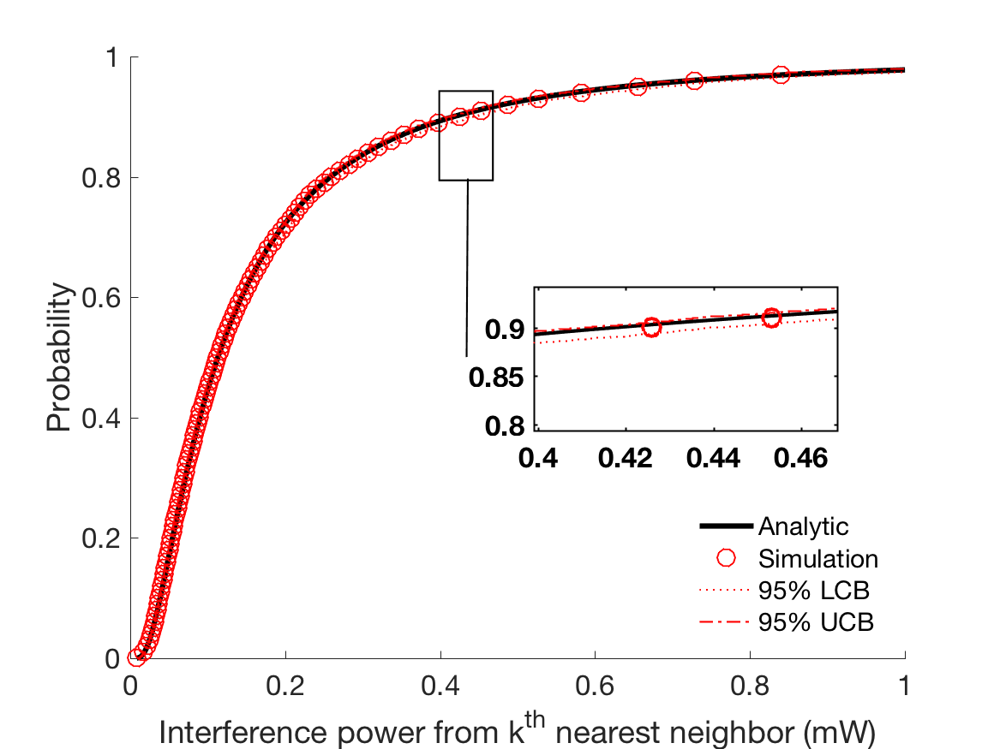

.. include:: substitutions.rst

Implementation, Results and Discussion
======================================

Implementation and Methodology
~~~~~~~~~~~~~~~~~~~~~~~~~~~~~~~~~~~~

Writing the methodology lies at the core of the paper, and fulfills one of the basic principles underlying the scientific method. Any scientific paper needs to be verifiable by other researchers, so that they can review the results by replicating the experiment and guaranteeing the validity. To assist this, you need to give a completely accurate description of the equipment and the techniques used for gathering the data [Shuttleworth2016]_.

Other scientists are not going to take your word for it, and they want to be able to evaluate whether your methodology is sound. In addition, it is useful for the reader to understand how you obtained your data, because it allows them to evaluate the quality of the results. For example, if you were trying to obtain data about shopping preferences, you will obtain different results from a multiple-choice questionnaire than from a series of open interviews. Writing methodology allows the reader to make their own decision about the validity of the data. If the research about shopping preferences were built upon a single case study, it would have little external validity, and the reader would treat the results with the contempt that they deserve [Shuttleworth2016]_.

Describe the materials and equipment used in the research. Explain how the samples were gathered, any randomization techniques and how the samples were prepared. Explain how the measurements were made and what calculations were performed upon the raw data. Describe the statistical techniques used upon the data [Shuttleworth2016]_.

Present any important details of your implementation here.

Results
~~~~~~~~

Present your AHCv2 run results, plot figures.

This is probably the most variable part of any research paper, and depends upon the results and aims of the experiment. For quantitative research, it is a presentation of the numerical results and data, whereas for qualitative research it should be a broader discussion of trends, without going into too much detail. For research generating a lot of results, then it is better to include tables or graphs of the analyzed data and leave the raw data in the appendix, so that a researcher can follow up and check your calculations. A commentary is essential to linking the results together, rather than displaying isolated and unconnected charts, figures and findings. It can be quite difficulty to find a good balance between the results and the discussion section, because some findings, especially in a quantitative or descriptive experiment, will fall into a grey area. As long as you not repeat yourself to often, then there should be no major problem. It is best to try to find a middle course, where you give a general overview of the data and then expand upon it in the discussion - you should try to keep your own opinions and interpretations out of the results section, saving that for the discussion [Shuttleworth2016]_.

.. list-table:: Title
   :widths: 25 25 50
   :header-rows: 1

   * - Heading row 1, column 1
     - Heading row 1, column 2
     - Heading row 1, column 3
   * - Row 1, column 1
     -
     - Row 1, column 3
   * - Row 2, column 1
     - Row 2, column 2
     - Row 2, column 3

Discussion
~~~~~~~~~~

Present and discuss main learning points.

.. [Shuttleworth2016] M. Shuttleworth. (2016) Writing methodology. `Online <https://explorable.com/writing-methodology>`_.